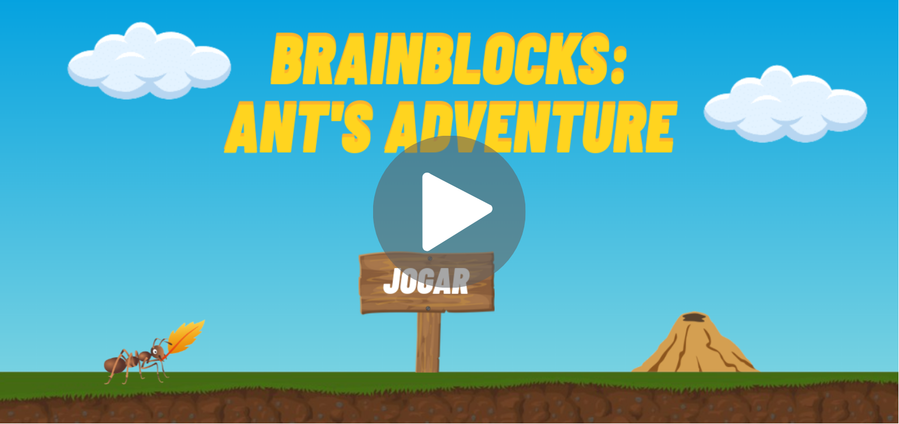

# BrainBlocks: Ant's Adventure

## Descrição

Este projeto foi apresentado na 12ª edição do Campus Mobile, e consiste em um jogo educativo projetado para ensinar conceitos de lógica computacional por meio de programação em blocos, alinhando-se às competências do eixo de Pensamento Computacional no Complemento à BNCC. Os usuários são desafiados a auxiliar uma formiga a alcançar o formigueiro, construindo o caminho através de blocos de programação que incluem comandos como início, fim, avançar, coletar, virar à direita, além de instruções condicionais e de repetição para fases mais avançadas. Cada fase apresenta desafios específicos, como a coleta máxima de folhas ou a passagem pelo número mínimo de blocos. Esses desafios são contextualizados, proporcionando motivação ao usuário, como a formiga estar perdida ou procurando alimento. 

## Inovação

- **Personalização dos Desafios:** Coletamos diversos dados dos alunos, incluindo o tempo de conclusão de desafios, erros cometidos, número de tentativas, entre outros, para fornecer relatórios abrangentes sobre o desempenho da turma aos professores. Além disso, a intenção é utilizar esses dados para treinar um modelo de aprendizado de máquina, personalizando os desafios conforme as dificuldades individuais dos alunos.
- **Coleta de Dados:** A coleta incluirá informações sobre a operadora do dispositivo, qualidade do sinal de internet e localização do aluno, visando mapear o nível das escolas e compreender possíveis impactos de variáveis como a distância da escola. Todos os dados serão coletados anonimamente, utilizando identificadores únicos por dispositivo, e os usuários terão a opção de consentir ou não com a coleta. O processo de coleta, processamento e uso dos dados será estritamente conforme a LGPD.
- **Ferramenta de Apoio para Professores:** Oferecemos relatórios abrangentes sobre o desempenho da turma, permitindo que os professores acompanhem o progresso dos alunos e identifiquem áreas que necessitam de mais atenção.
- **Contextualização dos Desafios:** Os desafios são apresentados de maneira contextualizada, proporcionando uma narrativa envolvente que motiva os usuários a resolverem os problemas apresentados.

## Público-Alvo

O público-alvo são jovens de 12 a 18 anos, abrangendo alunos do ensino fundamental e médio, tanto em escolas públicas quanto particulares. Esta faixa etária foi escolhida por estar contemplada pela Base Nacional Comum Curricular (BNCC). 

Além dos alunos, as escolas também são consideradas como público-alvo, pois nosso objetivo principal é fornecer a elas uma ferramenta para ensinar competências da BNCC por meio do nosso aplicativo. As escolas, portanto, servem como meio para alcançar nosso público-alvo final. 

Adicionalmente, com a coleta de dados, as secretarias de educação e órgãos relacionados também se tornam público-alvo, uma vez que esses dados podem ser úteis para auxiliar na tomada de decisões e na análise do desempenho das escolas.

## Impacto

Com a introdução da obrigatoriedade da Computação na grade curricular das escolas de ensino fundamental e médio em todo o território nacional, a partir de 01/11/23, as instituições de ensino têm a necessidade de incluir competências relacionadas à computação. O aplicativo proporciona uma maneira eficaz de atender a essas competências, conforme definidas no complemento à Base Nacional Comum Curricular (BNCC) homologado em 2022. Ao tornar a Computação na Educação Básica um direito de todos, as escolas precisam de ferramentas que garantam o acesso dos alunos aos fundamentos dessa disciplina, e o aplicativo visa atender a essa demanda de forma prática e educativa.

## Informações adicionais

O aplicativo é uma adaptação e inspiração do jogo de programação em blocos desplugado criado pela professora Maria Amélia da UFV-Campus Florestal. Esse jogo desplugado tem sido empregado com sucesso no ensino do pensamento computacional para alunos do ensino fundamental, médio e graduação, demonstrando resultados positivos. A versão digital busca proporcionar uma experiência similar e eficaz, ampliando o alcance do ensino de pensamento computacional de forma acessível e interativa.
